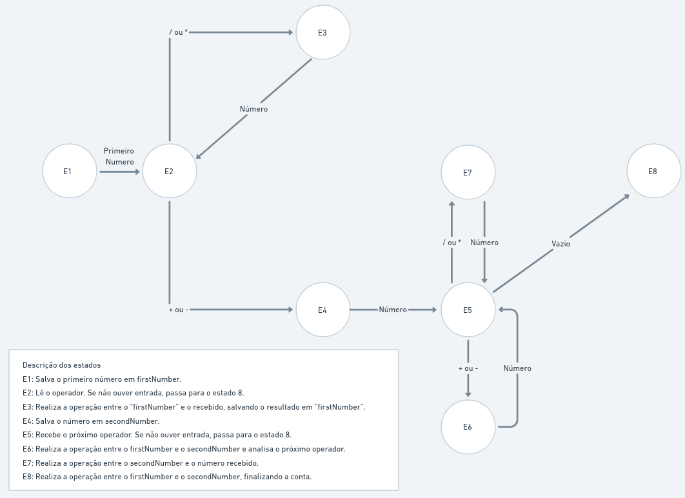
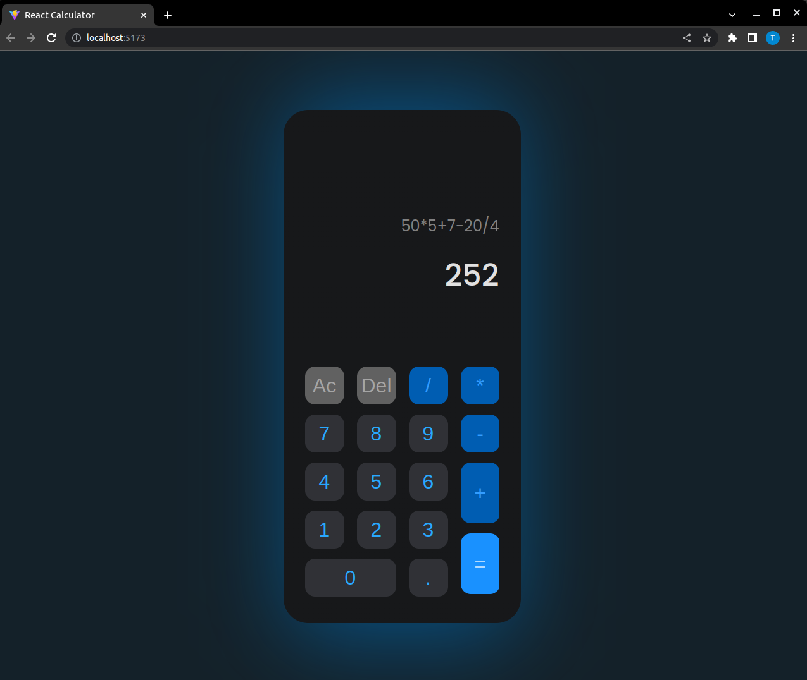

## This is a simple calculator made using **React**.

### It's desing was created by Sadek Hossen Rony, here is a [link](https://www.figma.com/community/file/984658356416751911) to his Figma project.

### To install and run the project follow this steps:

```bash
$ git clone https://github.com/ThiagoLD02/React_Calculator.git

$ cd React_Calculator

$ npm install

$ npm run dev
```

<br><br>

## This is a diagram of the Finity State Machine used to implement the logic to process the operations.



<br><br>

## An example image



<br><br>

## This is a GIF to ilustrate the calculator running

<div style="display: flex; justify-content: center; align-items: center; height: 100vh;">
  
</div>
